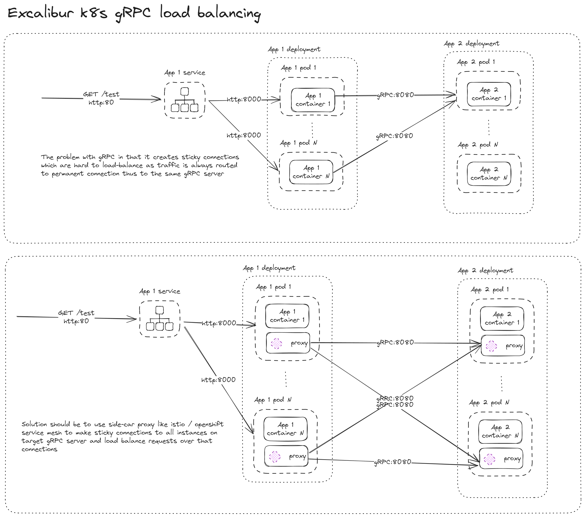

# Loadbalancing Test

## 1. Overview

The situation is that we have two apps, `app-1` and `app-2`, that are connected via gRPC. `app-1` is a frontend app that listens on port `8000`, responds on route `/test` and queries the backend app via gRPC. `app-2` is a backend app that listens on port `8080` (gRPC).



## 2. <TL;DR>

```sh
# clone repository
git clone https://github.com/JurajBrabec/loadbalancing-test.git
cd loadbalancing-test

# create project and apps
oc new-project loadbalancing-test
oc apply -f manifests/app-1
oc apply -f manifests/app-2

# install Operators
oc apply -f manifests/operators -n openshift-operators

# Install Service Mesh components
oc create namespace istio-system
oc apply -f manifests/servicemesh-control-plane.yml -n istio-system
oc apply -f manifests/servicemesh-member-roll.yml -n istio-system

# NOTE: sometimes, scale down of apps to 0 an then back needed, as sidecars don't deploy. Solution would be to annotate deployments at this stage. I prefer to have them annotated already in manifests.

#oc scale deployment app-1 --replicas=0
#oc scale deployment app-2 --replicas=0
#oc scale deployment app-1 --replicas=1
#oc scale deployment app-2 --replicas=3

oc apply -f manifests/istio-config.yml

# Observe APP_1 route or Kiali route for results.
```

## 3. Preparations

### 3.1 Path to `oc` command (CRC environment only)

```sh
@FOR /f "tokens=*" %i IN ('crc oc-env') DO @call %i
```

### 3.2 Required permissons

Log in to Openshift as a user with `cluster-admin` rights (for Operators installation).

### 4.4 Clone repository

```sh
git clone https://github.com/JurajBrabec/loadbalancing-test.git
cd loadbalancing-test
```

## 4. Install applications

### 4.1 Create project

```sh
oc new-project loadbalancing-test
```

### 4.2 Install APP_1

Create the frontend app, that listens on port `8000`, responds on route `/test` and queries the backend app via gRPC.

```shell
oc apply -f manifests/app-1
```

#### 4.2.1 Optional commands

Set the environment variable for `app_2` connection

```sh
oc set env deployment app-1 APP_2_ADDR=app-2:8080
```

Scale the application as needed

```sh
oc scale deployment app-1 --replicas=2
```

Set the cookie name (by default name is random)

```sh
oc annotate route app-1 router.openshift.io/cookie_name="app_1"
```

Set the route load balancing policy

```sh
 oc annotate route app-1 haproxy.router.openshift.io/balance=leastconn
```

Disable cookies entirely (to test LB via browser too)

```sh
oc annotate route app-1 haproxy.router.openshift.io/disable_cookies=true
```

Remove the app

```sh
oc delete all --selector app=app-1
```

### 4.3. Install APP_2

Create the backend service, that listens on port `8080` (gRPC)

```sh
oc apply -f manifests/app-2
```

#### 4.3.1 Optional commands

Scale the application as needed

```sh
oc scale deployment app-2 --replicas=4
```

Changes the service type to `LoadBalancer`

```sh
oc patch service app-2 -p '{"spec":{"type":"LoadBalancer"}}'
```

Remove the app-2

```sh
oc delete all --selector app=app-2
```

### 4.4 Test the applications

```sh
oc get route app-1 -o jsonpath='{.spec.host}'

#set URL=<url>
# for /l %l in (0,0,1) do; @curl %URL%/test & echo. & timeout 1 > NUL
```

Open the `http://<url>` path in browser

### 4.5 Removal

Remove everything at once

```sh
oc delete all --selector app.kubernetes.io/part-of=loadbalancing-test
oc delete project loadbalancing-test
```

## 5. Service Mesh

### 5.1 Configure VM (CRC environment only)

```sh
crc config set memory 21504
crc config set disk-size 62
```

### 5.2 Install Operators

```sh
#oc create namespace openshift-operators
oc apply -f manifests/operators -n openshift-operators
```

#### 5.2.1 Check installation process

List installed subscriptions

```sh
oc get subscription -A
```

Get current CSV for subscription

```sh
# Jaeger
oc get subscription jaeger -n openshift-operators -o template --template '{{.status.currentCSV}}'

# Kiali
oc get subscription kiali -n openshift-operators -o template --template '{{.status.currentCSV}}'

# Service Mesh
oc get subscription servicemesh -n openshift-operators -o template --template '{{.status.currentCSV}}'
```

Get installation status for a CSV

```sh
oc get csv <csv> -o template --template '{{.status.phase}}'

#'Succeeded'
```

### 5.3 Install Service Mesh Control Plane

```sh
oc create namespace istio-system
oc apply -f manifests/servicemesh-control-plane.yml -n istio-system
```

Get installation status

```sh
oc get smcp -n istio-system

#NAME    READY   STATUS            PROFILES      VERSION   AGE
#basic   9/9     ComponentsReady   ["default"]   2.5.1     80s
```

### 5.4 Install Service Mesh Member Roll

```sh
oc apply -f manifests/servicemesh-member-roll.yml -n istio-system
```

Get installation status

```sh
oc get smmr -n istio-system

#NAME      READY   STATUS       AGE
#default   1/1     Configured   5s

oc get smm

#NAME      CONTROL PLANE        READY   AGE
#default   istio-system/basic   True    5s
```

### 5.5 Istio configuration

- https://istio.io/latest/docs/reference/config/networking/
- https://istio.io/latest/docs/concepts/traffic-management/#load-balancing-options

```sh
oc apply -f manifests/istio-config.yml
```

### 5.6 Open the Kiali console in browser

```sh
oc get route kiali -n istio-system -o jsonpath='{.spec.host}'
```

Open the `http://<url>` path in browser

### 5.7 Service Mesh Removal

```sh
oc delete namespace istio-system
oc delete -f manifests/operators -n openshift-operators
```

## 6. References

### 6.1 gRPC

- https://github.com/grpc/grpc-node/tree/master/examples/helloworld

### 6.2 Openshift

- https://docs.openshift.com/container-platform/4.15/networking/routes/route-configuration.html
- https://kubernetes.io/docs/reference/networking/virtual-ips/#session-affinity
- https://docs.openshift.com/container-platform/4.15/cli_reference/openshift_cli/developer-cli-commands.html

### 6.3 Service Mesh

- https://docs.openshift.com/container-platform/4.15/service_mesh/v2x/installing-ossm.html
- https://developers.redhat.com/articles/2023/01/30/run-app-under-openshift-service-mesh
- https://www.densify.com/openshift-tutorial/openshift-service-mesh/
- https://github.com/rhthsa/openshift-demo/blob/main/openshift-service-mesh.md

### 6.4 Istio

- https://istio.io/latest/docs/reference/config/networking/
- https://istio.io/latest/docs/concepts/traffic-management/#load-balancing-options

istioctl install --set profile=openshift

istioctl uninstall -y --purge
oc delete ns istio-system istio-operator

oc -n istio-system expose svc/istio-ingressgateway --port=http2

oc label namespace loadbalancing-test istio-injection=enabled

## 7 Linkrd

linkerd check --pre
linkerd install --crds | oc apply -f -
linkerd install | oc apply -f -
linkerd check
